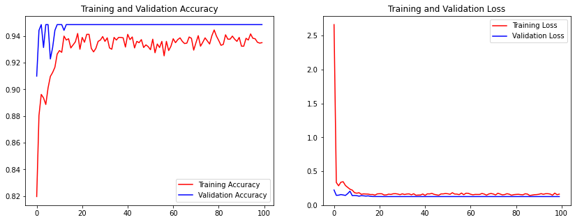

# Klasikikasi Gambar pada Penyakit daun jagung menggunakan CNN

> Anggota Kelompok Kelas Pembelajaran Mesin B :
> - Jody Ririt Krido Suseno - 201810370311073
> - Muhammad Aries Ramadhan - 201810370311076

## Journal
Pada jurnal dataset yang digunakan menggunakan dataset gambar yang berasal dari PlantVillage. 
Pada dataset ini dilakukan preprocessing seperti data augmentation dan spliting data. 
Model yang digunakan pada praktikum ini adalah Model arsitektur yang bernama Alexnet dengan akurasi 93%.
 

## Dataset
Dataset yang digunakan adalah Plant LEaf Diseses yang bersumber dari PlantVillage. dalam dataset tersebut memiliki 39 kelas yang berbeda dari daun tanaman dan gambar latar belakang. 

Namun kita hanya menggunkan 4 kelas untuk klasifikasi penyakit daun jagung. dengan deskripsi seperti berikut:
- Link Dataset : [Dataset : Plant Leaf Diseases](https://data.mendeley.com/datasets/tywbtsjrjv/1)
- Jumlah image pada dataset 3852.
- Jumlah image pada setiap kelas
  - healthy               : 1162
  - Cercospora            : 513
  - common rust           : 1192
  - northern leaf blight  : 958
- Jumlah persentase spliting dataset
  - Data Train            : 80% - 3044
  - Data Validation       : 19% - 772
  - Data Test             : 1%  - 36

## Preprocessing
Preprocesing data menggunakan metode berikut :
- Augmentasi Data
  - rescale = 1./255
  - horizontal flip = True
  - vertical flip = True
  - rotation range = 90
  - height shift range = 0.2
  - width shift range = 0.2
  - zoom range = 0.2
  - validation split = 0.7
  - size = (224, 224)
  - color mode = 'rgb'
  - class mode = 'categorical'
  - shuffle = True
- Spliting Data
  - Data Train            : 80% 
  - Data Validation       : 19% 
  - Data Test             : 1% 

## Model
Model yang digunakan adalah Alexnet Model
- Model 1 (Alexnet)
  - Summary 
    
  - Confution matriks evaluation 
    
  - grafik akurasi dan loss 
    
  - Classification Report 
    |                      | precision | recall | f1-score | support |
    |----------------------|-----------|--------|----------|---------|
    | Cercospora           | 0.84      | 0.74   | 0.79     | 405     |
    | Common_rust          | 1.00      | 1.00   | 1.00     | 942     |
    | Northern_Leaf_Blight | 0.87      | 0.93   | 0.90     | 779     |
    | Corn_healthy         | 0.99      | 0.99   | 0.99     | 556     |
    |                      |           |        |          |         |
    | macro avg            | 0.93      | 0.92   | 0.92     | 2682    |
    | weighted avg         | 0.94      | 0.94   | 0.94     | 2682    |
    | accuracy             |           |        | 0.94     | 2682    |
- Model 2 (Densenet201)
  - matriks evaluation 
    
  - grafik akurasi dan loss 
    
  - Classification Report 
    |                      | precision | recall | f1-score | support |
    |----------------------|-----------|--------|----------|---------|
    | Cercospora           | 0.89      | 0.83   | 0.86     | 405     |
    | Common_rust          | 0.99      | 0.99   | 0.99     | 942     |
    | Northern_Leaf_Blight | 0.91      | 0.94   | 0.93     | 779     |
    | Corn_healthy         | 1.00      | 1.00   | 1.00     | 918     |
    |                      |           |        |          |         |
    | macro avg            | 0.95      | 0.94   | 0.95     | 3044    |
    | weighted avg         | 0.96      | 0.96   | 0.96     | 3044    |
    | accuracy             |           |        | 0.96     | 3044    |
## Predict pada sample data
Model yang digunakan adalah Alexnet Model
- Model 1 (Alexnet)
  
- Model 2 (Densenet201Model)
  

## Sumber Referensi
 - [Dataset : Plant Leaf Diseases](https://data.mendeley.com/datasets/tywbtsjrjv/1)
 - [Artikel rujukan](http://dx.doi.org/10.12928/telkomnika.v18i3.14840)

